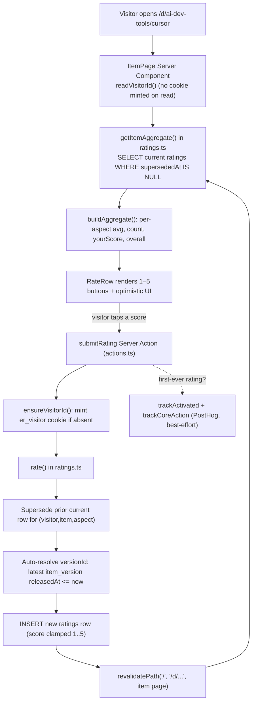

# How EverythingRated works, end to end

This is the learning-tier explainer: a single read that connects the whole
system, from a visitor clicking a star to a row landing in D1 and back into an
aggregate. It grounds every claim in the actual code. For terse reference pages,
see [overview.md](overview.md), [data-model.md](data-model.md), and
[ratings-pipeline.md](ratings-pipeline.md); this page links to them rather than
repeating them.

## What it actually is

EverythingRated is a **multi-axis ratings platform**. The bet: a single star
score throws away the decision context, so instead each **directory** (a kind of
thing — AI dev tools, databases, hosting) defines its own **aspects** (rating
axes), and visitors rate each **item** on every aspect. See
[product/overview.md](../product/overview.md) for the bet and current scope.

Concretely, the whole thing is:

- One **Next.js 16 App Router** app (`apps/web`) compiled to a **single
  Cloudflare Worker** via `@opennextjs/cloudflare`.
- One **Cloudflare D1** SQLite database (`everythingrated-db`), accessed through
  **Drizzle ORM** (`packages/db`).
- **No accounts.** A visitor is an httpOnly `er_visitor` cookie, minted only on
  the first write. Ratings are anonymous and scoped to that cookie.

There is no separate backend service, no queue, no external rating source — the
Worker reads and writes D1 directly inside Server Components and Server Actions.

## The pieces and where they live

| Component | Code | Role |
| --- | --- | --- |
| Worker entry | `apps/web/worker.mjs` | Wraps OpenNext with an edge cache, agent surfaces, and timing. |
| Agent edge | `apps/web/agent-edge.mjs` | Short-circuits `/llms.txt`, `/api/ai`, `.md`, etc. — see [edge-and-agent-surfaces.md](edge-and-agent-surfaces.md). |
| Pages / routes | `apps/web/src/app/**` | App Router: `/` grid, `/d/[directory]`, `/d/[directory]/[item]`, JSON + RSS feeds, `/moderation`. |
| DB binding | `apps/web/src/lib/db.ts` | `getDb()` pulls the live D1 binding from the request context. |
| Schema | `packages/db/src/schema.ts` | Authoritative table + index definitions (Drizzle). |
| Rating queries | `apps/web/src/lib/ratings.ts` | All reads (aggregates) and the single write (`rate()`). |
| Server Actions | `apps/web/src/lib/actions.ts` | `submitRating` and moderation mutations. |
| Visitor cookie | `apps/web/src/lib/visitor.ts` | `readVisitorId()` (read) vs `ensureVisitorId()` (mint on write). |

## Data model in one breath

Five tables carry the core loop (`packages/db/src/schema.ts`):

- `directories` — a self-contained kind of thing, with its own rubric.
- `aspects` — a rating axis, **scoped to one directory** (`(directoryId, key)`
  is unique, not global).
- `items` — a rateable thing inside a directory (`(directoryId, slug)` unique).
- `ratings` — one score by one visitor on one aspect of one item. **Append-only
  history**: re-rating does not update, it sets `supersededAt` on the old row and
  inserts a new one.
- `item_versions` — a sparse release timeline so a rating can be anchored to the
  version that was current when it was cast.

Two more support submissions (`item_submissions`, `directory_submissions`) and
one supports the stack recommender (`item_tags`). Full rationale and the indexes
that matter are in [data-model.md](data-model.md) — not repeated here.

The scope premise falls straight out of the uniqueness rules: two directories can
each own an aspect called "performance" or an item called "Postgres", because
uniqueness is per-directory. That is the product, expressed as a constraint.

## The primary flow: rating an item

The core user journey is: open an item page, tap a 1–5 score per aspect, see
the average move.

### Read path (rendering the page)

1. `ItemPage` (`apps/web/src/app/d/[directory]/[item]/page.tsx`) is
   `dynamic = 'force-dynamic'` and calls `readVisitorId()` — read-only, so **no
   cookie is minted** just for viewing.
2. It calls `getItemAggregate(dirSlug, itemSlug, visitorId)` in `ratings.ts`,
   which loads the item, its directory's aspects, and that item's `ratings`,
   filtering to `supersededAt == null` (the "current view").
3. `buildAggregate()` reduces those rows into, per aspect: the mean `score`, the
   `count`, and `yourScore` (this visitor's own current score). `overall` is the
   mean of the per-aspect averages, ignoring aspects with no ratings;
   `totalRaters` is the distinct visitor count.

### Write path (`rate()`)

`submitRating` (`actions.ts`) is a Server Action:

1. `ensureVisitorId()` reads or **mints** the `er_visitor` cookie (httpOnly,
   SameSite=Lax, one-year maxAge). Minting emits a PostHog `signup` — the
   anonymous-product stand-in for account creation.
2. It probes `countVisitorRatings()` (a `LIMIT 1` existence check, not a
   `COUNT`) *before* writing, so a first-ever rating can also fire `activated`.
3. `rate()` validates that the aspect belongs to the item's directory, **clamps
   the score to 1..5**, supersedes the visitor's prior current row for that
   `(visitor, item, aspect)`, auto-resolves `versionId` to the latest
   `item_version` released at or before now (null if none seeded), then inserts
   the new row.
4. `revalidatePath` invalidates the home grid, the directory page, and the item
   page, so the next render reflects the write. The UI already showed the change
   optimistically.

The full aggregation and comparison logic lives in
[ratings-pipeline.md](ratings-pipeline.md).

## Serving path: the Worker wrapper

Requests do not hit Next.js first. `apps/web/worker.mjs` wraps OpenNext:

1. `handleAgentEdge(request)` short-circuits agent/LLM indexing surfaces
   (`/llms.txt`, `/api/ai`, page markdown) before any framework code runs.
2. For `GET`s on a small allow-list of cacheable document paths (`/`, `/d/...`,
   `/trending`, etc.), it consults `caches.default` and serves an edge `HIT`
   with a `stale-while-revalidate` policy, bypassing the app entirely.
3. Otherwise it hands off to OpenNext → the App Router, which renders Server
   Components (reads) and runs Server Actions (writes) against D1.
4. `withTiming` wraps everything to set a `Server-Timing` header and log slow
   (>200 ms) requests.

## Key decisions and why

These are the load-bearing choices; each has a canonical home linked below.

- **No auth in the POC** ([ADR-0001](decisions/ADR-0001-no-auth-in-poc.md)).
  Identity is a cookie so the multi-axis UX can be tested before the cost of
  accounts, moderation, and abuse handling. Cheap to reason about; the trade-off
  is soft identity (clearing cookies resets you).

- **Cookies minted only on write, never on read.** `readVisitorId` is used in
  pages; `ensureVisitorId` only in Server Actions. This keeps page renders
  cacheable and avoids polluting the visitor space with drive-by bots. Adding
  read-time cookie middleware would break both — see the "Why no middleware"
  note in [overview.md](overview.md).

- **Ratings are append-only, not upserted.** A re-rate supersedes rather than
  overwrites, so the full history survives for trends and version anchoring
  without a separate audit table. Every "current" aggregate pays for this with a
  `supersededAt IS NULL` filter, backed by `ratings_superseded_idx`. Rationale:
  [ratings-pipeline.md](ratings-pipeline.md) and
  [architecture decision index](decisions/README.md).

- **Aspects and items are per-directory, not global.** This is the product bet
  encoded as unique indexes — it is *why* an AI editor and a database can be
  rated on entirely different axes.

- **Aggregation is a full pull + JS reduce, on purpose.**
  `listItemsWithAggregates` loads a directory's current ratings and reduces in
  JS. Fine at POC scale; the schema already supports swapping to SQL `AVG` /
  `GROUP BY` if a directory grows (noted in
  [ratings-pipeline.md](ratings-pipeline.md)).

- **One Worker, D1 co-located via smart placement.** `[placement] mode =
  "smart"` in `wrangler.toml` runs the Worker near D1 so read/write round-trips
  don't cross the planet; psi-swarm flagged TTFB > 1 s before this. See
  [architecture overview](overview.md).

- **Narrowed to AI dev tools.** Other seeded directories still work via direct
  link but are hidden from primary entry points
  ([ADR-0002](decisions/ADR-0002-narrow-to-ai-dev-tools.md),
  `apps/web/src/lib/directory-focus.ts`).

## Where to go next

- [data-model.md](data-model.md) — tables, indexes, constraints.
- [ratings-pipeline.md](ratings-pipeline.md) — aggregation, comparison boards,
  stack recommender.
- [edge-and-agent-surfaces.md](edge-and-agent-surfaces.md) — Worker entry, agent
  indexing, feeds, sitemap.
- [decisions/README.md](decisions/README.md) — ADRs and the pointer index into
  `plans/`.
